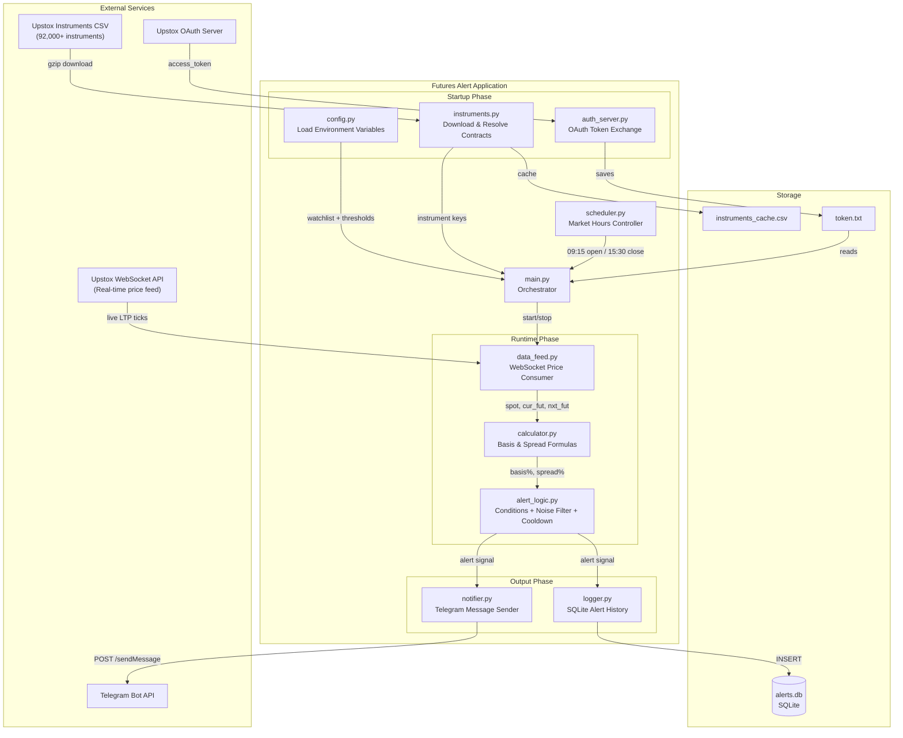
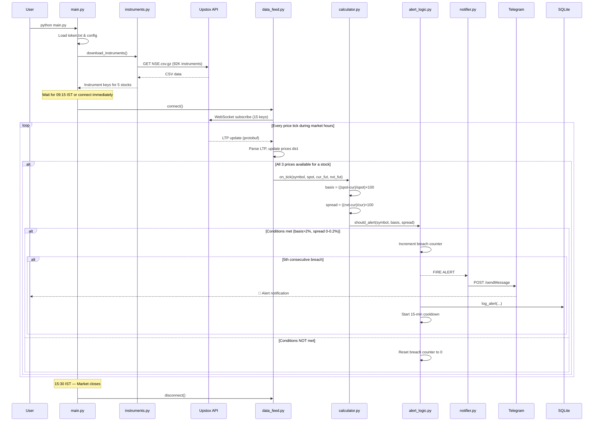
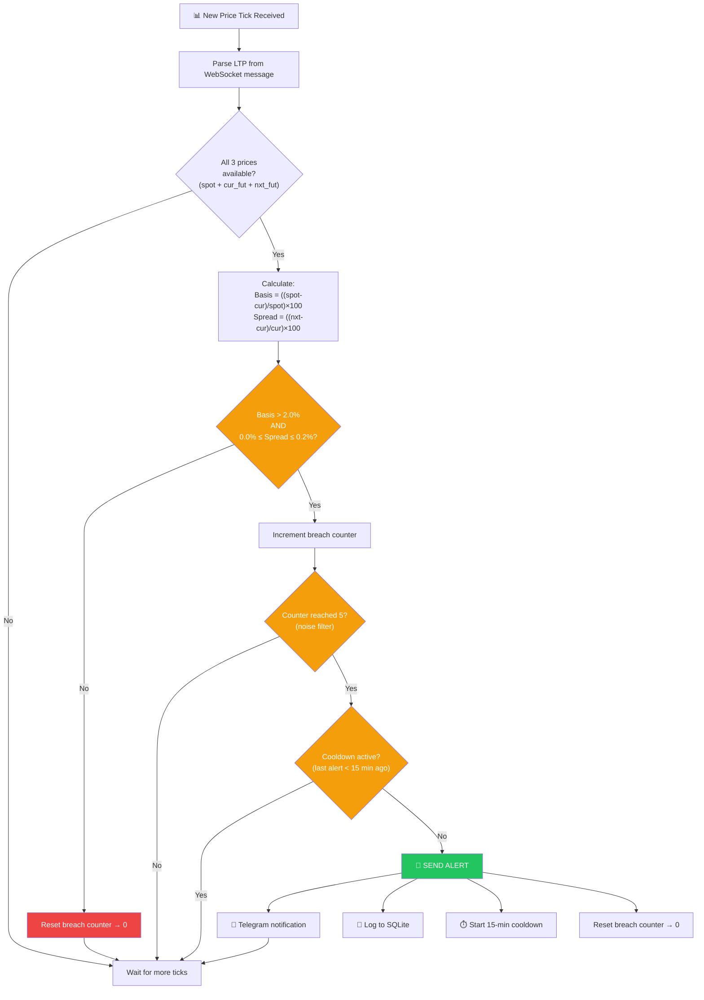
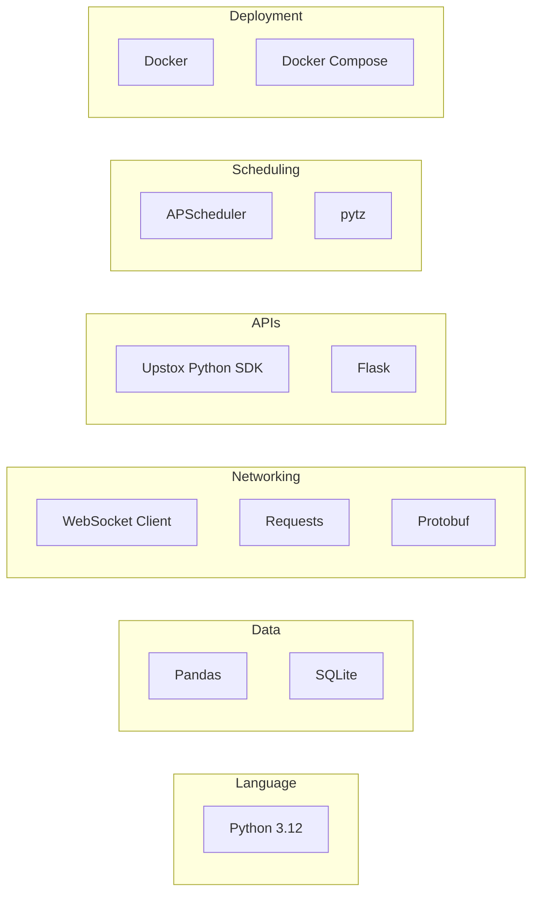
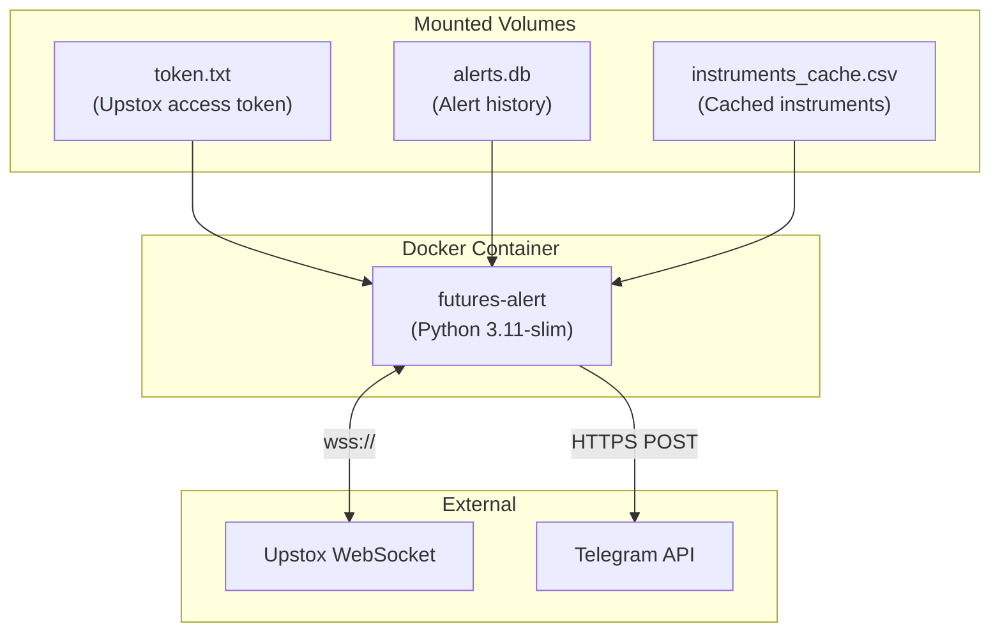

# Futures Alert — System Documentation

## What You Built

**Futures Alert** is an automated stock market surveillance system that monitors NSE (National Stock Exchange of India) futures in real-time and sends instant Telegram notifications when it detects a specific pricing anomaly — **futures trading at a significant discount to the spot price while the calendar spread remains tight**.

---

## The Problem It Solves

### Background: How Futures Pricing Works

In a normal market, stock futures trade at a **slight premium** to the spot (cash) price. This premium exists because of the **cost of carry** — the interest cost of holding the position until expiry.

```
Normal:  Future Price  >  Spot Price   (premium — expected)
Anomaly: Future Price  <  Spot Price   (discount — unusual)
```

### When Futures Trade at a Discount

Sometimes, due to heavy selling pressure, panic, or institutional unwinding, the **futures price drops below the spot price**. This creates what's called a **basis discount**.

> [!IMPORTANT]
> A futures discount of **>2%** is unusual and can signal:
> - Heavy institutional selling / unwinding
> - A potential short-term buying opportunity (mean reversion)
> - Market stress or event-driven dislocation

### Why the Calendar Spread Matters

The app also checks that the **spread between current and next month futures is tight (0%–0.2%)**. A tight spread confirms:
- The discount is **structural**, not just an expiry-related distortion
- Both months are pricing similarly, meaning the market broadly expects this level
- It's not an artefact of low liquidity in one contract

### The Opportunity

By detecting these conditions **in real-time** (rather than manually checking charts), a trader can act quickly on potential mean-reversion trades before the market corrects.

---

## System Architecture



---

## How Data Flows — Step by Step



---

## Alert Decision Logic



---

## Module Breakdown

| Module | Role | Key Functions |
|--------|------|---------------|
| [config.py](file:///home/meritech-219/Desktop/projects/discount-on-stock/futures-alert/config.py) | Loads all settings from `.env` | Environment variables → Python constants |
| [instruments.py](file:///home/meritech-219/Desktop/projects/discount-on-stock/futures-alert/instruments.py) | Downloads & parses 92K NSE instruments | `download_instruments()`, `get_active_contracts()` |
| [calculator.py](file:///home/meritech-219/Desktop/projects/discount-on-stock/futures-alert/calculator.py) | Pure math — two formulas | `compute_basis()`, `compute_spread()` |
| [alert_logic.py](file:///home/meritech-219/Desktop/projects/discount-on-stock/futures-alert/alert_logic.py) | Brain — conditions + noise + cooldown | `AlertEngine.should_alert()` |
| [data_feed.py](file:///home/meritech-219/Desktop/projects/discount-on-stock/futures-alert/data_feed.py) | WebSocket consumer for live prices | `PriceFeed.connect()`, `_on_message()` |
| [notifier.py](file:///home/meritech-219/Desktop/projects/discount-on-stock/futures-alert/notifier.py) | Sends formatted Telegram alerts | `send_telegram()` |
| [logger.py](file:///home/meritech-219/Desktop/projects/discount-on-stock/futures-alert/logger.py) | Persists alert history to SQLite | `init_db()`, `log_alert()`, `get_recent_alerts()` |
| [scheduler.py](file:///home/meritech-219/Desktop/projects/discount-on-stock/futures-alert/scheduler.py) | Auto start/stop at market hours | `is_trading_day()`, `get_scheduler()` |
| [auth_server.py](file:///home/meritech-219/Desktop/projects/discount-on-stock/futures-alert/auth_server.py) | Silent TOTP & OAuth token acquisition | `attempt_silent_login()`, Flask callback |
| [main.py](file:///home/meritech-219/Desktop/projects/discount-on-stock/futures-alert/main.py) | Ties everything together | Entry point |

---

## Technology Stack



| Layer | Technology | Purpose |
|-------|-----------|---------|
| Language | Python 3.12 | Core runtime |
| Data Processing | Pandas | Parse 92K instrument CSV |
| Database | SQLite | Store alert history locally |
| Real-time Feed | WebSocket + Protobuf | Receive live price ticks from Upstox |
| HTTP | Requests | Download instruments CSV, send Telegram messages |
| Auth | Flask | Local OAuth callback server on port 5000 |
| Scheduling | APScheduler + pytz | Cron jobs in Asia/Kolkata timezone |
| Config | python-dotenv | Load `.env` file variables |
| Deployment | Docker + Docker Compose | Container-based deployment |

---

## Deployment Architecture



The app runs as a single long-lived Docker container that:
- Starts automatically on boot (`restart: unless-stopped`)
- Reads credentials from the mounted `.env` file
- Persists alert history via the mounted `alerts.db` volume
- Caches the instruments CSV to avoid re-downloading on restart

---

## Summary

| Aspect | Detail |
|--------|--------|
| **What** | Real-time NSE futures discount detector with Telegram alerts |
| **Problem** | Manually monitoring futures-vs-spot pricing across 5 stocks is impractical |
| **Solution** | Automated WebSocket-based surveillance with configurable thresholds |
| **Signal** | Futures discount > 2% AND calendar spread between 0–0.2% |
| **Noise Reduction** | 5 consecutive tick confirmation + 15-min cooldown per stock |
| **Output** | Instant Telegram notification + SQLite audit trail |
| **Schedule** | Auto-runs during NSE market hours (09:15–15:30 IST, Mon–Fri, skipping holidays) |
